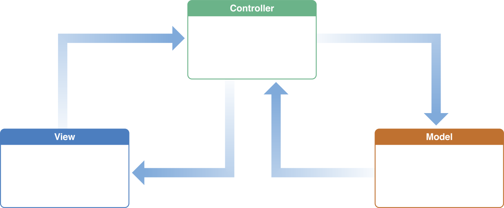

# How to cook reactive programming. Part 1: Unidirectional architectures introduction.

This article could be read not only by iOS developers. I use super basic concepts of the language. You should understand it with knowledge of any modern programming language.

While ago I wrote an article [What is Reactive Programming? iOS Edition](https://medium.com/atimca/what-is-reactive-programming-43e60cc4c0f?source=friends_link&sk=4ab8aa82f6e669bad59be42cba67e0ef) where I in super basic way described how to build your own Reactive Framework and helped you to understand that nodoby should scary of reactive way. Previous arcticle now could be named **How to cook reactive programming. Part 0.** since this one is a sort of continuation of the previous one. I would recommend to read the previous one if you are not familiar with reactive programming concepts.

Today we are going to talk more about practical aspect of reactive programming. I've already mensioned that's it's too easy to shoot into the foot, after you started to use any reactive framework, so I want to show you a way how to secure yourself)

## The problems

For the beginning I want to describe some common problems with a reactive programming and with the most common approaches nowadays.

Let's start with reactive problems. The most common fear about reactive that when you start to use it you would reach a point when in your code hundreds of data sequences flying around and you as a developer stop to have any power over it.

### Unpredicted mutations

The first and the most problem of what reactive way could do for you is unpredicted mutations. Let me make an example:

```swift
class Foo {
    var val: Int?

    init(val: Int?) {
        self.val = val
    }
}

var array: [Foo] = [Foo(val: 1), Foo(val: 2), Foo(val: 3)]

array = array.map { element in
    array[0].val = element.val
    return element
}

// array == 3, 2, 3
```

For the simplicity of reasons I've replaced reactive sequence with an array. Example itself is super oversimplified way of how could you screw up, doing any reactive things. Nobody could predict, where and when you changed data, we have so many ways to do it and they are so many hidden of them under reactive framework implementations.

However, how we can handle this, how can we protect ourselfs? First of all we should move from `reference` types to the `value` ones.

```swift
struct Foo {
    var val: Int?
}

var array: [Foo] = [Foo(val: 1), Foo(val: 2), Foo(val: 3)]

array = array.map { element in
    array[0].val = element.val
    return element
}

// array == 1, 2, 3
```

Just with this simple change, I protect my array from unpredicted mutation. As far as you know `structs` are value types and they copy thereselfs all the time (there's a copy on write mechanism, but you got the idea).

However, wait for a second, let's try to move one step forward and try to make one radical movement. Let's make variable `val` a constant.

```swift
struct Foo {
    let val: Int?
}

var array: [Foo] = [Foo(val: 1), Foo(val: 2), Foo(val: 3)]

array = array.map { element in
    array[0].val = element.val // Cannot assign to property: 'val' is a 'let' constant
    return element
}
```

Oh yeah, that's the protection I'm talking about. Now we don't have any chance to mutate our data on the way though the data `Sequence`.

What we are going to do with all this? All mobile apps are not pictures, they are not static, we need mutate data to `react` on user behaviour or any other external changes such as network data or timers. The app is a living being. So we have two problems to solve. We need to keep our value entities in the floating sequences and we need somehow to mutate data to show changes to the user. That's sounds like a chalange, but wait for it, let's talk a little bit of modern architectures. Enetually this is an article about architecture over there.

### MV family

The problem above is not only about reactive approach. You can face it everywhere, no matter paradigm you use. Let's make a small step back and talk a little bit about modern app architectures.



I can bet, you have seen this guy before. Actualy for my personal opinion most of the modern architectures looks like this. They could be called MVsomething family. MVP, VIPER, MVVM same but different. I don't want to go deep inside to try to understand what the difference between them, you've alredy know it without me. Let's talk about common things. They are all small peaces, separated by screens, single views or just peace of business logic. Whoever is familiar with the topic will understand in advance what I'm getting at. With all this architectures super easy to bump into inconsistent state of the app. Let me make an example imagine you have a home page in your app and this home page depends on the logged in user. You have had a quite complicated app already with possibility to sign in or sign out user from different parts of the app. Already got what I'm talking? Imagine you decided to sign out from one part of the app and your home page should `react` on this change. Let me just show a gif with it.


You can use some user service, which will notify all subscribers to this service about any changes with a user. This approach has two problems. First problem: I think that servives should be stateless they shouldn't hold any information, just perform actions. Second problem: imagine that we have more than one situation where we need share info between several modules. In this case we'd have bunch of dirty services and we'd end up in the start point with a lot of floating mutations.

What to do in this situation? I'll give you an answer shortly.

## One ring to rule them all


As I said an application is a living, changing system. How in this situation save data in sequences immutable and how to stop to spread sources of truth withing the whole code base? What if I say, we can have the only one source of truth for the entire application? Sounds riduculos, but let's try to build this kind of system.

As I said before only one state object is needed. Let's create it.

```swift
struct State {
    var value: Int?
}
```

Quite easy, ha? System should be as simple as possible. There is only one source of truth and every other characters in the code base `observe` all changes withing this state. Let's try to implement this as wel.

```swift
protocol Observer {
    func stateWasChanged(with newState: State)
}

struct State {
    var value: Int?
}

class Store {
    var state: State = State() {
        didSet {
            observers.forEach { observer in
                observer.stateWasChanged(with: state)
            }
        }
    }

    var observers: [Observer] = []
}

struct Foo: Observer {
    func stateWasChanged(with newState: State) {
        print("It's newState from Foo: ", newState.value)
    }
}

struct Boo: Observer {
    func stateWasChanged(with newState: State) {
        print("It's newState from Boo: ", newState.value)
    }
}

let foo = Foo()
let boo = Boo()

let store = Store()
store.observers = [foo, boo]
store.state.value = 10

// It's newState from Foo:  10
// It's newState from Boo:  10
```

What I've done? There's a state object which holds data from the whole application. `Store` is a kind of mediator, who controls everything. Two `Observer` objects, which `subscribed` on every state change. And mostly that's it. By the way do you remember the user example before? Listed solution perfectly handles this situation. However, there's one big problem. The state was changed directly via `store.state.value = 10`. This approach could lead to the same problems, which I'm trying to rid off right now. I'm going to fix it with a solid сoncept of `Event`.

One remark. I know that `observers` are holded with a strong reference in `Store` and it should be avoided in the real project. How to achive this, you can find in the previous article, again) Here I want to save some time. Back to `Event`.

```swift
enum Event {
    case changeValue(newValue: Int?)
}

class Store {
    private var state: State

    func accept(event: Event) {
        switch event {
        case .changeValue(let newValue):
            state.value = newValue
        }
    }
}
```

For now nobody can mutate state in an unpredictable way. The way of mutatation is clear, structured and incapsulated under `Event` concept. If you have noticed, for now you cannot reach `State` just like a property of the store. I made it on purpose, because reactive programming is about `reaction` on system changes, as I described in my previous article.

Wait a minute... Take a look at signature of standard `reduce` function in Swift:

```swift
func reduce<Result>(_ initialResult: Result, _ nextPartialResult: (Result, Element) -> Result) -> Result
```


It looks almost the same like our `accept` function. There's an intialResult as previous `State` and some function to mutate `State` according to the `Event`. Let's refactor existed code a little bit.

```swift
class Store {
    func accept(event: Event) {
        state = reduce(state: state, event: event)
    }

    func reduce(state: State, event: Event) -> State {
        var state = state
        switch event {
        case .changeValue(let newValue):
            state.value = newValue
        }
        return state
    }
}
```

Much better. However, take a look at a `reduce` function... It looks like it's complitly independant of the `Store` and mostly any other object. Why is so? A `reduce` function is a pure function it has it's input parameters and one output. It also means, that no matter what is going on in `Store` itself `reduce` will work in the same way. So, maybe we should extract it out of the store and make it as a high order function? Sounds like a great idea, doesn't it. Only one moment. Seams like `reduce` close to `State`, so let put it under `State` namespace.

Here's a final result of our DIY architecture.

```swift
protocol Observer {
    func stateWasChanged(with newState: State)
}

struct State {
    var value: Int?

    static func reduce(state: State, event: Event) -> State {
        var state = state
        switch event {
        case .changeValue(let newValue):
            state.value = newValue
        }
        return state
    }
}

enum Event {
    case changeValue(newValue: Int?)
}

class Store {
    var state: State = State() {
        didSet {
            observers.forEach { observer in
                observer.stateWasChanged(with: state)
            }
        }
    }

    var observers: [Observer] = []

    func accept(event: Event) {
        state = State.reduce(state: state, event: event)
    }
}
```

As a result we've got a simple unidirectional architecture. However, there's so many questions left. We leave not in the syncronous world, where it's possible to put every mutation through the `reduce` function syncronosly. Indeed internet requests or timers, coudn't be added like this to the approach, that I introduced above. To resolve this problem, we'll use `SideEffects` approach, but about it I'll write in the my next article) Almost forgot about one important thing. Why the architecture called unidirectional?) To make a clear explanation, I need make you familiar with `SideEffects` as well. So, stay tuned!

If you don't want to loose any new articles `subscribe` to my [twitter account](https://twitter.com/atimca)))

```swift
Twitter(.atimca)
.subscribe(onNext: { newArcticle in
    you.read(newArticle)
})
```

https://twitter.com/mobileunderhood/status/1250773949287407617

https://twitter.com/mobileunderhood/status/1250805880813236225

https://twitter.com/mobileunderhood/status/1250831101247066112